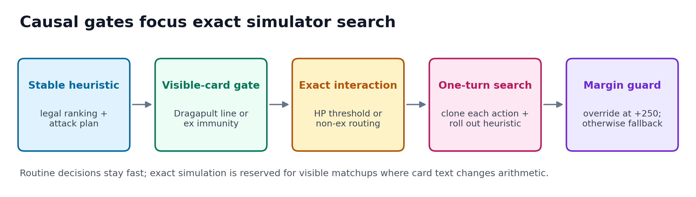
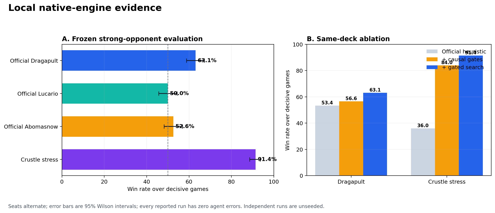

# When Rules Break Heuristics

## Gated search for Mega Lucario ex

This repository accompanies my entry to the Kaggle **The Pokémon Company –
PTCG AI Battle Challenge Strategy** competition. The agent keeps a dependable
rule policy for ordinary turns, activates card-text gates for visible tactical
exceptions, and uses deterministic one-turn simulator search only in those
matchups.

## Frozen local results

| Matchup | Games | Win rate | Wilson 95% CI | Errors |
|---|---:|---:|---:|---:|
| Search Lucario vs official Dragapult | 500 | 63.1% | 58.7–67.2% | 0 |
| Search Lucario vs official Lucario | 500 | 50.0% | 45.6–54.4% | 0 |
| Search Lucario vs official Abomasnow | 500 | 52.6% | 48.2–56.9% | 0 |
| Search Lucario vs Crustle stress deck | 500 | 91.4% | 88.6–93.6% | 0 |

These are reproducible **local** evaluations against published agents and a
targeted stress deck. I did not enter the earlier Simulation track, so the
project makes no claim of an official hidden-ladder score.

## Why the policy works

1. **Stable heuristic:** the Apache-2.0 official Mega Lucario sample supplies a
   legal fallback and handles routine sequencing.
2. **Causal gates:** visible Pokémon-ex immunity redirects the plan through a
   one-Prize Hariyama line; a visible Stage 2 increases the value of Gravity
   Mountain and the 270 + 30 damage threshold.
3. **Gated search:** only triggered by those visible exceptions. Every legal
   main-phase action is cloned with the official Search API, the heuristic
   completes the turn, and a prize-and-board value scores the leaf.
4. **Conservative replacement:** search overrides the heuristic only with a
   margin of at least 250 points; any search failure falls back safely.

In 1,000 gated games, search made 21,479 calls, changed 3,271 decisions
(15.2%), and produced zero agent errors.

## Repository map

- `agent/main.py` – submitted policy source
- `agent/deck.csv` – 60-card Mega Lucario ex deck
- `report/kaggle_writeup.md` – complete Strategy writeup
- `report/technical_appendix.md` – implementation and evaluation details
- `figures/` – upload-ready PNG and SVG figures
- `results/` – frozen aggregate CSV summaries

## Running the agent

The agent expects the official `cg` Python package and native battle library
provided through the competition environment. Place that runtime on
`PYTHONPATH`, then import `agent/main.py` as the policy module. Raw competition
card tables and native engine binaries are deliberately absent from this public
repository because their redistribution is outside this project's scope.

## Evidence boundary

The native library exposes no public seed hook. Seats alternate, every game
starts with fresh policy state, errors are recorded, and draws are excluded
only from the win-rate denominator. Aggregate CSVs are included; raw game logs
are omitted to keep the release compact.

## Links and attribution

- [Kaggle Strategy competition](https://www.kaggle.com/competitions/pokemon-tcg-ai-battle-challenge-strategy)
- [Official API documentation](https://matsuoinstitute.github.io/cabt/)
- [Official Mega Lucario sample](https://www.kaggle.com/code/kiyotah/a-sample-rule-based-agent-mega-lucario-ex-deck)
- [Official Dragapult sample](https://www.kaggle.com/code/kiyotah/a-sample-rule-based-agent-dragapult-ex-deck)

The policy derives from the official Apache-2.0 Mega Lucario sample by Hiroshi
Kiyota and The Pokémon Company. See `LICENSE` and `NOTICE.md` for details.
Pokémon and Pokémon TCG are trademarks of their respective owners. This is an
independent competition project and is not endorsed by The Pokémon Company.
